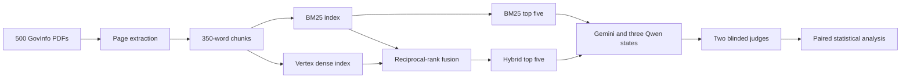

# Lean RAG

Lean RAG is a reproducible comparison of a local 9 billion parameter model and
Gemini 3.8 Flash on the same retrieval-augmented generation workload.

The project asks a practical question: can a small, locally deployable model
answer questions over a real document collection well enough to replace a
hosted frontier model for many applications?

The answer from this experiment is yes, with qualifications. The best local
configuration reached **79.5%**, compared with **82.0%** for Gemini 3.8 Flash,
when both models received the same five passages from the Vertex hybrid
retriever.

[Read the complete findings](FINDINGS.md) | [Review the hybrid experiment](HYBRID_EXPERIMENT.md) | [Open the public model](https://huggingface.co/vamsee9201/qwen35-9b-hybrid-rag-lora)

## Result at a glance

The final experiment used 50 sealed questions and eight matched evaluation
cells. Each generator received byte-identical questions, evidence, evidence
order, and system prompts within a retrieval condition.

| Generator | BM25 | Vertex hybrid | Exact citation recall with hybrid |
|---|---:|---:|---:|
| Gemini 3.8 Flash | 75.0% | **82.0%** | 73% |
| Base Qwen3.5 9B | 76.5% | 77.0% | 57% |
| BM25-trained Qwen3.5 9B | 76.0% | **79.5%** | 73% |
| Hybrid-trained Qwen3.5 9B | 75.5% | 77.5% | **74%** |

The primary score is the normalized mean of two independently randomized blind
judges, Gemini 3.8 Flash and untuned Qwen3.5 9B. Every cell contains 50 answers.

The best local configuration was the **BM25-trained Qwen adapter with Vertex
hybrid retrieval**. Its point estimate was 2.5 percentage points below Gemini.
The separate hybrid-trained adapter did not improve performance, which is an
important negative result: a model does not necessarily need to be fine-tuned
again when the retrieval system changes.

## Why this experiment matters

Hosted models are easy to call, but they are not the right answer for every
system. Teams also care about privacy, connectivity, predictable costs,
customization, reproducibility, and control over model availability.

This experiment contributes evidence on those tradeoffs instead of comparing
models with unrelated prompts or retrieval results. It:

- holds retrieved evidence constant when comparing generators;
- separates retrieval improvements from generator improvements;
- tests whether fine-tuning learned general RAG behavior or overfit one
  retriever;
- uses public government documents and a sealed held-out benchmark;
- evaluates 400 answers with two independently blinded model judges;
- reports paired confidence intervals and a predefined non-inferiority margin;
- preserves a negative fine-tuning result instead of reporting only the best
  run; and
- publishes the code, adapter, benchmark, checksums, and result tables.

The most useful finding is not simply that Qwen came close to Gemini. The
experiment shows how it got close. Better retrieval raised the quality of the
evidence, while one targeted LoRA adapter taught the local model grounded answer
style and citation behavior that transferred to a different retriever.

## How we closed the gap with Gemini

1. **Build a real corpus.** The project downloaded public GovInfo PDFs and froze
   a deterministic 500-document subset. Of those, 450 contained searchable
   extracted text.
2. **Keep the evidence traceable.** Text was stored by document and page, then
   split into 350-word chunks with 50-word overlap.
3. **Separate train, validation, and test documents.** The searchable splits
   contain 315, 45, and 90 documents. No document crosses splits.
4. **Establish a lexical baseline.** SQLite FTS5 provided pure BM25 retrieval.
5. **Add semantic retrieval.** Vertex AI `gemini-embedding-001` vectors were
   fused with BM25 rankings using reciprocal-rank fusion.
6. **Fine-tune Qwen.** The first LoRA adapter used 2,256 verified RAG records
   built with BM25 contexts. Training used one epoch, rank 8, alpha 32, and
   all-linear targets.
7. **Test adapter transfer.** The BM25-trained adapter was evaluated unchanged
   with hybrid contexts and became the strongest local configuration.
8. **Run a controlled second fine-tune.** A new adapter was trained from the
   original Qwen base with the same supervision rebuilt around hybrid contexts.
   It worked correctly but did not beat the first adapter.
9. **Evaluate without revealing identities.** Candidate model and retriever
   names were hidden from both judges, with independent candidate shuffles.
10. **Quantify uncertainty.** The final comparisons used 10,000 paired bootstrap
    samples and a five-point non-inferiority margin.



## Retrieval findings

| Retriever | All-gold recall | Mean passage recall | MRR | nDCG |
|---|---:|---:|---:|---:|
| BM25 | 70% | 77% | 0.710 | 0.697 |
| Vertex dense | **78%** | 83% | 0.740 | 0.727 |
| BM25 plus Vertex hybrid | **78%** | **84%** | **0.811** | **0.777** |

Hybrid retrieval produced the strongest overall ranking. Cross-document
questions remain the main weakness. Dense retrieval found useful evidence that
fusion occasionally pushed out of the final five passages, so retrieval fusion
and document diversity are the next engineering targets.

## Fine-tuning findings

Two Qwen3.5 9B LoRA adapters were trained independently from the original base
model:

| Adapter | Training context | Selected checkpoint | Hybrid score |
|---|---|---:|---:|
| BM25-trained adapter | BM25 top-five contexts | 500 | **79.5%** |
| Hybrid-trained adapter | Vertex hybrid top-five contexts | 564 | 77.5% |

The hybrid-trained adapter completed successfully, reached a validation loss of
0.06357, passed a 20-example reload test, and achieved the best exact citation
recall. It still trailed the BM25-trained adapter by two points on the primary
answer score under hybrid retrieval.

This result suggests that the first adapter learned behavior that generalized:
use supplied evidence, answer concisely, cite document and page identifiers,
and abstain when necessary. Merely changing the distractor distribution did not
add enough new information to justify another fine-tune.

## Cost and savings

The full second experiment cost approximately **$10.99**.

| Component | Estimated cost |
|---|---:|
| Vertex document and query embeddings | $8.38 |
| 100 Gemini answers | $0.23 |
| 400 Gemini judge scores | $0.10 |
| Qwen smoke test and full fine-tune | $1.30 |
| 300 Qwen evaluation answers | $0.62 |
| 400 Qwen judge scores | $0.35 |
| **Total** | **$10.99** |

The embedding bill is primarily a one-time corpus indexing cost. Documents can
be searched repeatedly after their vectors are stored. New online query
embeddings still incur a small usage charge in the current Vertex hybrid setup.

### Potential production inference cost

The 100 Gemini answers averaged approximately 2,815 input tokens and 57 output
tokens. At the recorded global introductory price of $0.75 per million input
tokens and $3.75 per million output tokens, that workload costs about **$2.33
per 1,000 answers**. Google lists standard pricing from January 1, 2027 at $1.50
and $7.50, which would make the same workload about **$4.65 per 1,000 answers**.

The best Qwen adapter averaged about 4.17 billed L40S seconds per hybrid answer
in this experiment. At $1.80 per L40S hour, that is approximately **$2.09 per
1,000 answers** when the GPU is used continuously at the measured rate.

| Monthly answers with the measured prompt mix | Gemini through Dec. 2026 | Gemini from Jan. 2027 | Qwen on a fully utilized rented L40S |
|---|---:|---:|---:|
| 1,000 | $2.33 | $4.65 | $2.09 |
| 100,000 | $232.54 | $465.07 | $208.65 |
| 1,000,000 | $2,325.36 | $4,650.72 | $2,086.50 |

These are workload projections, not quotes. They exclude retrieval, networking,
storage, engineering labor, taxes, and idle GPU time. A dedicated L40S left on
for a 30-day month would cost about $1,296 at $1.80 per hour, even if it served
no requests. That makes utilization the deciding factor for rented local-model
infrastructure.

On owned hardware, Qwen has no external per-token generation fee. Its marginal
cost comes from electricity and hardware wear. This can provide substantial
savings at high volume or when suitable hardware already exists, but the
project does not claim that local inference is automatically cheaper for every
traffic level.

Pricing assumptions are dated September 6, 2026. See the official
[Google pricing page](https://cloud.google.com/gemini-enterprise-agent-platform/generative-ai/pricing)
and [Hugging Face Jobs pricing](https://huggingface.co/docs/hub/jobs-pricing)
before making a deployment decision.

## Advantages of the local model

### Works without a reliable connection

Qwen and the BM25 index can run entirely on a local machine. That makes the
system useful on flights, at field sites, aboard ships, in rural areas, during
network outages, and in other places where internet access is slow, expensive,
or unavailable. Answers do not wait for a round trip to a hosted API.

The current Vertex hybrid configuration is not fully offline because each new
query is embedded by Vertex AI. An offline deployment can use the tested BM25
path, or replace the Vertex query embedding stage with a compatible local
embedding model and validate that new retriever separately.

### Keeps document content under local control

Retrieved passages and questions can remain on the user's device or private
network. This is valuable for internal reports, legal material, operational
manuals, research notes, and regulated data where sending context to a hosted
generator may be undesirable.

### Removes per-token generation billing

An owned local deployment can answer more questions without accumulating a new
API charge for every prompt and completion. Costs become hardware capacity,
power, and maintenance rather than a token meter.

### Provides version and availability control

The exact base model and LoRA adapter can be archived and redeployed. A provider
cannot silently change that local checkpoint, remove it from an API, reduce a
quota, or make it unavailable during an outage.

### Supports targeted customization

The LoRA adapter is small compared with the base model and can be retrained for
a specific answer format, citation policy, vocabulary, or domain. This project
also shows when retraining is unnecessary, which can save time and compute.

### Enables edge and private-network products

The model can be packaged with a local corpus for laptops, workstations,
on-premises servers, mobile field stations, and disconnected private networks.
It can also serve as a fallback when a hosted model is unavailable.

## Tradeoffs

- Gemini had the highest observed hybrid answer score, 82.0% versus 79.5% for
  the best local setup.
- Local inference needs sufficient memory, storage, power, and thermal capacity.
- A laptop deployment may be slower and consume significant battery power.
- The operator is responsible for model updates, security patches, monitoring,
  and capacity planning.
- Fifty questions provide useful paired evidence but cannot resolve small
  quality differences precisely.
- The two judges were models. Blinded human-review sheets are included, but
  human scoring has not been completed.
- Vertex AI does not expose an immutable revision for
  `gemini-embedding-001`. The project records the date, settings, and checksums
  instead.

## Repository structure

| Path | Purpose |
|---|---|
| `scripts/` | Corpus, retrieval, generation, scoring, and reporting commands |
| `cloud/` | Hugging Face GPU training, inference, and judging entry points |
| `tests/` | Determinism, split, fusion, metric, and clipping tests |
| `FINDINGS.md` | Final interpretation and all major results |
| `HYBRID_EXPERIMENT.md` | Reproduction stages and frozen experiment settings |
| `FINETUNING_RESEARCH.md` | Fine-tuning design research and rationale |
| `data/` | Generated local artifacts, excluded from Git |

## Reproduce the project

Create the environment:

```sh
python3 -m venv .venv
.venv/bin/pip install -r requirements.txt
```

The downloader uses `GOVINFO_API_KEY` from the environment or the ignored
`.env` file. Vertex stages require an authorized Google Cloud service account.
Hugging Face jobs receive `HF_TOKEN` only through the encrypted Jobs secret
mechanism. Never commit credentials.

Run a small GovInfo download pilot:

```sh
.venv/bin/python scripts/download_govinfo.py --target 10
```

The complete commands for split-isolated Vertex indexing, fusion selection,
benchmark sealing, SFT materialization, training, inference, judging, and
reporting are documented in [HYBRID_EXPERIMENT.md](HYBRID_EXPERIMENT.md).

## Published artifacts

- [GitHub repository](https://github.com/vamsee9201/lean-rag)
- [BM25-trained Qwen3.5 9B adapter](https://huggingface.co/vamsee9201/qwen35-9b-rag-lora)
- [Hybrid-trained Qwen3.5 9B adapter and reproducibility bundle](https://huggingface.co/vamsee9201/qwen35-9b-hybrid-rag-lora)
- [GovInfo API documentation](https://github.com/usgpo/api)

The public bundle includes the sealed benchmark, checksums, retrieval metrics,
complete answer-quality tables, paired effects, cost data, and blank blinded
human-review sheets. Credentials and generated private working data remain
outside the repository.
